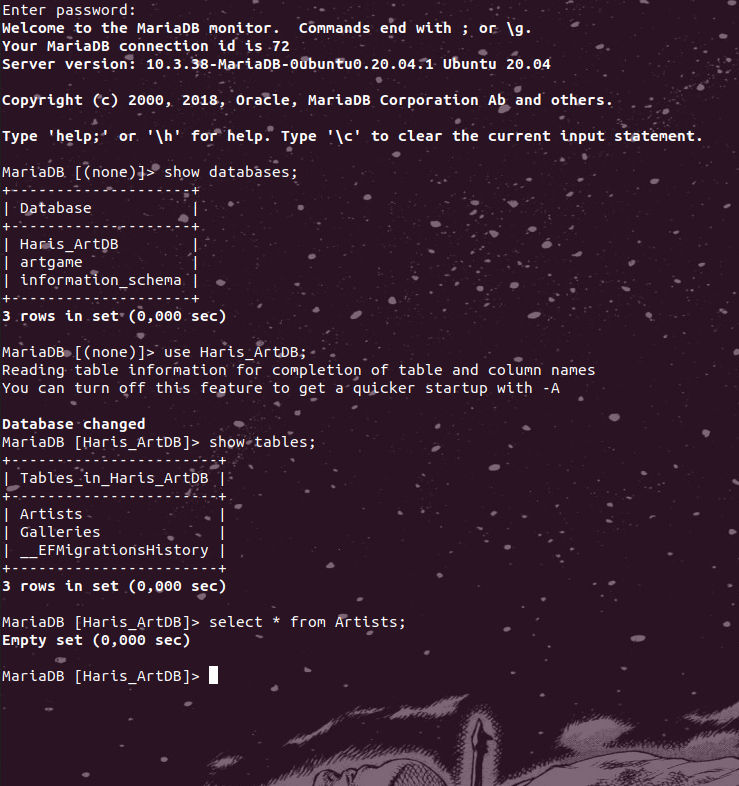
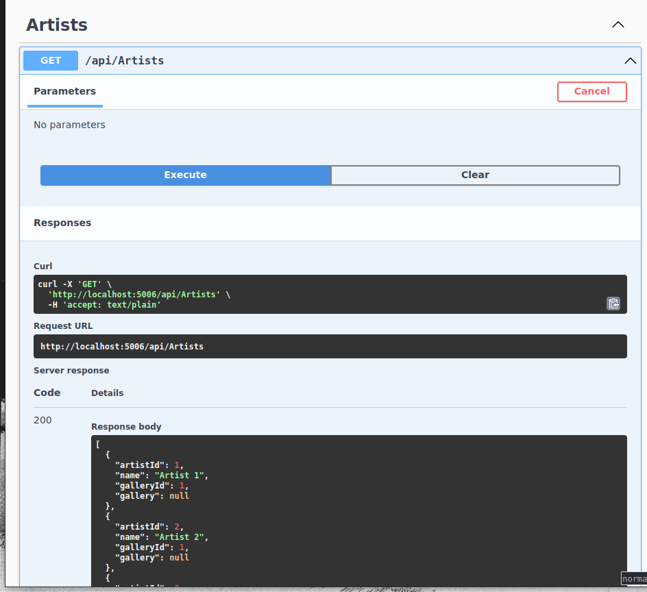
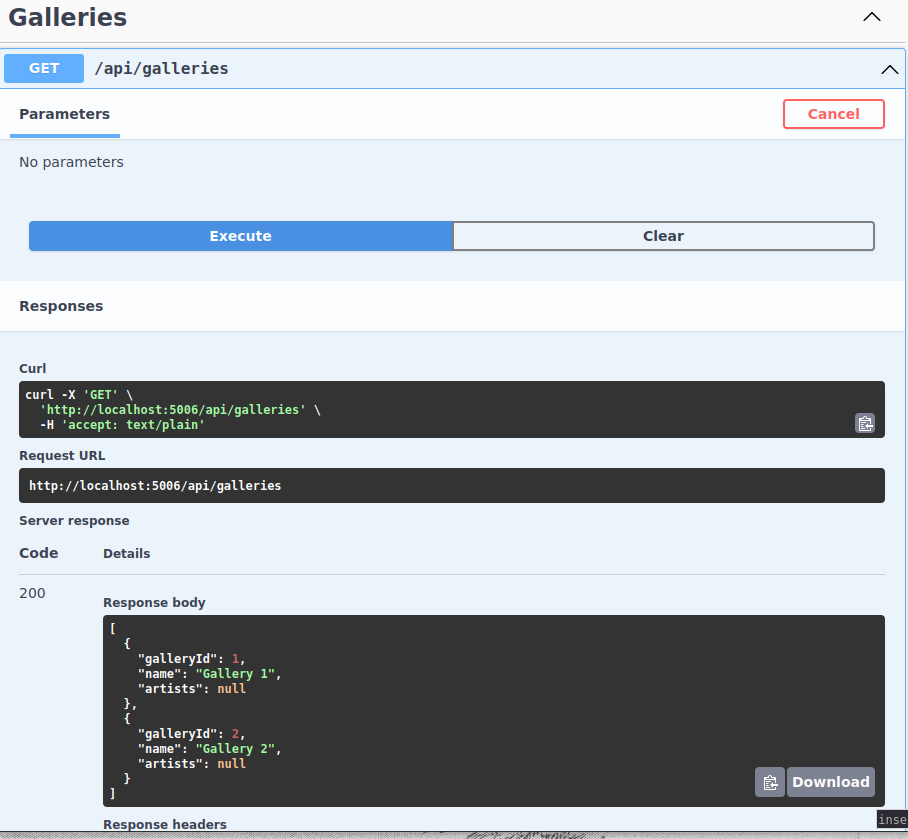

# ArtWebApi - Simple API for Managing Artists and Galleries with mariadb database

ArtWebApi is a indicative API designed to manage artists and galleries using a MariaDB database. This API empowers developers to perform CRUD (Create, Read, Update, Delete) operations on artist and gallery data seamlessly.

## Table of Contents

- [Entities](#entities)
- [Getting Started](#getting-started)
  - [Prerequisites](#prerequisites)
  - [Installation](#installation)
  - [Database Setup](#database-setup)
- [API Endpoints](#api-endpoints)
- [Data Storage](#data-storage)
- [Dependencies](#dependencies)

## Entities

### Artist
- Represents an artist with a unique identifier, name, and an optional association with a gallery.

### Gallery
- Represents a gallery with a unique identifier and a name. A gallery can have multiple associated artists.

## Getting Started

Before you dive into ArtWebApi, make sure you have the following prerequisites installed:

- [.NET Core SDK](https://dotnet.microsoft.com/download)
- [MariaDB](https://mariadb.org/download/)

### Installation

1. Clone the repository to your local machine:

2. Navigate to the project directory:
cd ArtWebApi

### Database Setup

1. Configure your MariaDB/MySQL database connection:
- Open the `appsettings.json` file.
- Set the connection string for your database under `"DefaultConnection"`.

2. Apply database migrations:
dotnet ef database update

## API Endpoints

ArtWebApi provides a comprehensive set of endpoints for managing artists and galleries. Here are the available endpoints:

### Artists

- **GET /api/artists**: Retrieve a list of all artists.
- **GET /api/artists/{id}**: Retrieve detailed information about a specific artist.
- **POST /api/artists**: Create a new artist.
- **PUT /api/artists/{id}**: Update an existing artist.
- **DELETE /api/artists/{id}**: Delete an artist.

### Galleries

- **GET /api/galleries**: Retrieve a list of all galleries.
- **GET /api/galleries/{id}**: Retrieve detailed information about a specific gallery.
- **POST /api/galleries**: Create a new gallery.
- **PUT /api/galleries/{id}**: Update an existing gallery.
- **DELETE /api/galleries/{id}**: Delete a gallery.

## Data Storage

ArtWebApi employs an in-memory data storage approach, as implemented in the `DataContext.cs` file. For simplicity and demonstration purposes, the `DataContext` class stores artist information in a `List<Artist>` object.

## Dependencies

This project relies on the following dependencies:

- Microsoft.AspNetCore.Mvc
- Microsoft.Extensions.DependencyInjection
- Microsoft.OpenApi.Models

Ensure that you have these dependencies installed and properly configured in your development environment.
##Demo
Here are some screeshots demostrating  the CRUD operations:

*Screenshot shows Database inittial

*Screenshot shows Database after seed 

*Screenshot shows  with Swagger Artists after database seeding

*Screenshot shows  with Swagger Galleries after database seeding

*Screenshot shows deletion on Artists tested with postman inittial
